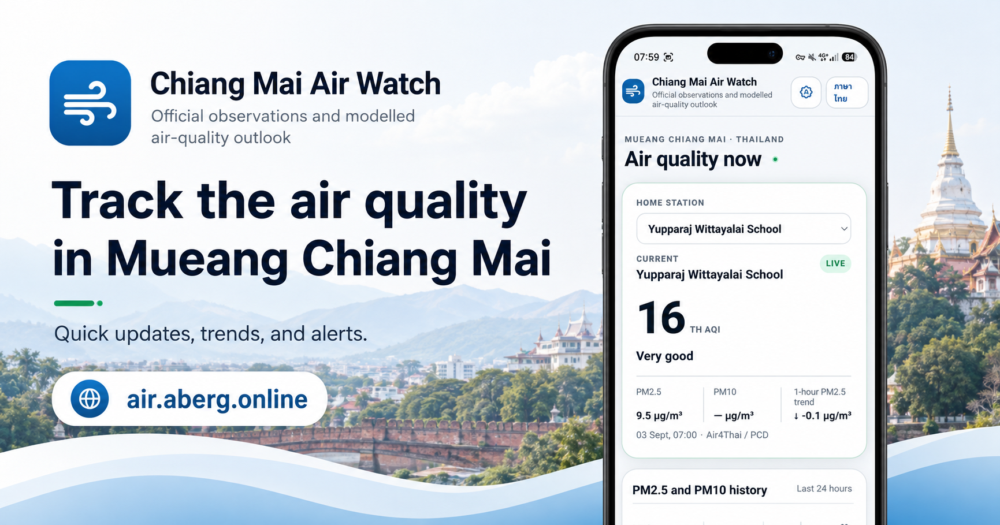

# Chiang Mai Air Watch



Webbapp och installerbar PWA för luftkvalitet i Mueang Chiang Mai, Thailand. Visar officiella observationer, kompletterande lokala sensorer, historik, modellprognoser och väderkontext.

**Webbplats:** [air.aberg.online](https://air.aberg.online)  
**Version:** 1.1.2  
**Gränssnitt:** engelska och thailändska

## Funktioner

- Officiell TH AQI, PM2.5, PM10 och tillgängliga övriga föroreningsvärden.
- Valbar hemstation med sparat val.
- Stationslista och karta med filtren All, Official och Local.
- Historik för 24h, 72h, 7d, 30d, 90d, 1y och 5y, beroende på tillgängliga data.
- Lokalt sensornät med median, min/max, trend och antal giltiga PM2.5-värden.
- Separat modellprognos och aktuell väderkontext.
- Web Push för officiella luftkvalitetsincidenter och återhämtning.
- Ljust, mörkt och systemstyrt tema.
- PWA med offline-snapshot, verklig spartid och tydlig OFFLINE-märkning.

## Datakällor och tolkning

| Källa | Användning |
| --- | --- |
| Air4Thai / Thailand Pollution Control Department | Officiella observationer, TH AQI, områdesstatus och alerts |
| CMU DustBoy / CMU CCDC | Kompletterande lokala PM2.5- och PM10-observationer |
| Open-Meteo / CAMS Global | Modellprognos för luftkvalitet |
| Open-Meteo Forecast | Temperatur, vind, vindbyar och nederbörd |
| OpenStreetMap | Kartunderlag |

Air4Thai-stationerna `air4thai:36t` och `air4thai:35t` är allowlistade. `36t`, Yupparaj Wittayalai School, är standardhemstation.

Officiell AQI lagras som `TH_AQI_2023`. Saknas källans AQI visas inget lokalt beräknat ersättningsvärde. DustBoy påverkar inte officiell områdesstatus, kategoriövergångar eller push. Modellerad US AQI och prognosrisk hålls åtskilda från officiell TH AQI.

Tider lagras i UTC och visas i `Asia/Bangkok`. Råpayload lagras i databasen; publika API:er lämnar normaliserade värden.

## Teknik och krav

- PHP 8.3; bland annat PDO MySQL, cURL, JSON, mbstring och OpenSSL. GD används för ikongenerering.
- MariaDB 10.11.
- Apache 2.4 och HTTPS för produktionsinstallation.
- Composer 2 för PHP-beroenden.
- Node.js 22 för utveckling, frontendberoenden och webbläsartester.
- Vanilla JavaScript, Chart.js, Leaflet och MarkerCluster.
- PHPUnit, Playwright och axe för verifiering.

PHP-applikationen behöver ingen Node-process i produktion. Projektet är fristående från Ping Flood Watch, med eget namespace `ChiangMaiAirWatch\`, databas, konfiguration och driftjobb.

## Installation och konfiguration

Kör kommandona från repositoryts rot. Använd en separat arbetskopia för utveckling och tester.

Installera utvecklingsberoenden:

```bash
composer install
npm ci
```

Förbered en separat databas med [basschemat](sql/schema.sql) och [stationsdata](sql/seed.sql). Befintliga installationer uppgraderas med migrationerna i [sql/migrations](sql/migrations). Administrativa migreringsrättigheter hålls åtskilda från runtime-användarens `SELECT`, `INSERT`, `UPDATE` och `DELETE`.

Konfigurationen är en PHP-fil som returnerar en array. [app/config.example.php](app/config.example.php) visar grundstrukturen; [app/Config.php](app/Config.php) innehåller standardvärden. Anpassa databas, miljö, public origin och hemligheter till installationen.

Konfiguration väljs i denna ordning:

1. Sökvägen i miljövariabeln `CMAW_CONFIG_FILE`, om den är satt; annars `/etc/chiang-mai-air-watch/config.php`.
2. `app/config.local.php` om den valda filen saknas.
3. Applikationens standardvärden.

I produktion används `/etc/chiang-mai-air-watch/config.php` med ägare `root:www-data` och behörighet `0640`. DB-lösenord, DustBoy-token, privat VAPID-nyckel och rate-limit-hemlighet ska inte checkas in i Git.

För lokal visning med en redan förberedd utvecklingsdatabas och konfigurationsfil:

```bash
CMAW_CONFIG_FILE=/absolute/path/to/development-config.php php -S 127.0.0.1:8765
```

Använd lokal `public_origin`, rätt `base_url` och avstängd push i utvecklingskonfigurationen. Den inbyggda PHP-servern är endast för lokal utveckling.

Produktionsberoenden installeras med:

```bash
composer install --no-dev --classmap-authoritative
```

Följ [installationsguiden](docs/INSTALL.md) för databasuppgradering, DustBoy-aktivering, katalogskydd, driftjobb och rollback. Driftverktygen är anpassade till installationen i `/var/www/abergonline/air`; granska sökvägarna före användning på en annan server.

## Datainsamling och drift

Publika sid- och API-anrop läser lagrade data. Schemalagda CLI-jobb kontaktar leverantörerna.

| Jobb | Intervall |
| --- | --- |
| `cron/collect_air.php` | Var 10:e minut; DustBoy har intern due-check på minst 55 minuter |
| `cron/collect_forecast.php` | Var 30:e minut |
| `cron/collect_weather.php` | Var 15:e minut |
| `cron/dispatch_push.php` | Varje minut |
| Daily summaries, retention och backup | Nattligen |

DustBoy använder kontots valda utomhusstationer, filtrerade till 15 km från centrum och högst tio stationer. Station-sync körs som dry-run som standard. Historikimport och insamling delar ett persistent anropstak på tio DustBoy-anrop per rullande timme.

Se [INSTALL.md](docs/INSTALL.md) för sync, backfill och summaries samt [PROVIDERS.md](docs/PROVIDERS.md) för providerregler.

## API

Exempel:

```text
GET /api/current.php?lang=en
GET /api/stations.php?lang=th
GET /api/history.php?station=air4thai:36t&period=24h
GET /api/forecast.php?lang=en
GET /api/alerts.php?lang=en
GET /api/status.php
GET /api/health.php
```

Framgångssvar använder `{ok:true,data,meta}` och fel `{ok:false,error:{code,message}}`. Live-API:er har `Cache-Control: no-store`. Health ger HTTP 200 när kontrollerna passerar och HTTP 503 vid degraderad drift.

Fullständigt kontrakt finns i [API.md](docs/API.md).

## Tester

Installera utvecklingsberoenden i en arbetskopia utanför den aktiva produktionskatalogen.

```bash
# Enhetstester
vendor/bin/phpunit --testsuite unit

# Integrationstester, efter att testdatabasens miljövariabler laddats
vendor/bin/phpunit --testsuite integration

# Webbläsartester mot en separat körande testinstans
npx playwright install chromium
CMAW_BASE_URL=http://127.0.0.1:8765 npm run test:e2e
```

Integrationstesterna kräver `CMAW_TEST_DSN`, `CMAW_TEST_DB_USER` och `CMAW_TEST_DB_PASSWORD`. De tömmer tabeller i den angivna databasen: använd endast en isolerad testdatabas, exempelvis `chiang_mai_air_watch_test`. Utan testuppgifterna markeras testerna som överhoppade.

Webbläsartesterna förutsätter en förberedd instans med stationsdata. Ange alltid `CMAW_BASE_URL` för lokal testning; konfigurationens fallback pekar på produktionssajten. Live-provider-tester i `tests/Live` gör verkliga upstream-anrop och körs separat.

Vid granskningen den 5 september 2026 verifierades 40 enhetstester, 14 integrationstester och 68 webbläsarfall vid 360, 390, 430 och 1280 px. Ett webbläsarfall behövde köras om efter en Chromium-krasch. Se [granskningsrapporten](docs/QUALITY_REVIEW_2026-09-05.md) för detaljer.

## Struktur

```text
api/          Publika JSON-endpoints
app/          PHP-kod, providers, tjänster, repositories, vyer och språkfiler
assets/       CSS, JavaScript, lokala bibliotek, fonter och ikoner
config/       Mallar för drift, webbserver och provider-certifikat
cron/         Insamling, backfill, push och retention
docs/         Installation, API, datakällor och verifieringsrapporter
scripts/      Installation, underhåll, migrering och backup
sql/          Schema, seed och migrationer
storage/      Runtime-loggar, cache och lås
tests/        Enhets-, integrations-, live- och webbläsartester
```

Beroendekataloger, runtime-data, testresultat och lokala hemligheter hör inte hemma i Git. Behåll `composer.lock` och `package-lock.json` för reproducerbara installationer. Befintliga releasepaket och databaskopior lagras utanför webbrot.

## Status och begränsningar

V1.1.2 innehåller rättningar för offline-läge, uppdatering av diagram och informationskort, providerkonfiguration samt väderfel.

Android Web Push, iPhone installerad PWA/Web Push och fysisk Home Screen-installation har bekräftats av operatören den 5 september 2026.

DustBoy-historiken för stationerna `5263` och `5264` var ännu ofullständig vid senaste granskningen. Separat liveverifiering av 30d/1y-historik återstod. En period i gränssnittet innebär därför inte att hela perioden har mätdata.

## Dokumentation

- [Installation och rollback](docs/INSTALL.md)
- [API](docs/API.md)
- [Datakällor](docs/PROVIDERS.md)
- [AQI-regler](docs/AQI.md)
- [Alerts och push](docs/ALERTS.md)
- [Test- och acceptansrapport](docs/TEST_REPORT.md)
- [Kvalitetsgranskning V1.1.2](docs/QUALITY_REVIEW_2026-09-05.md)
- [Releaseöversikt](docs/V1.1_RELEASE_REPORT.md)

## Licens

Projektets Composer-metadata anger `proprietary`. Ingen öppen källkodslicens har tilldelats projektet. Tredjepartsbibliotek och datakällor omfattas av sina respektive licenser och användningsvillkor.
